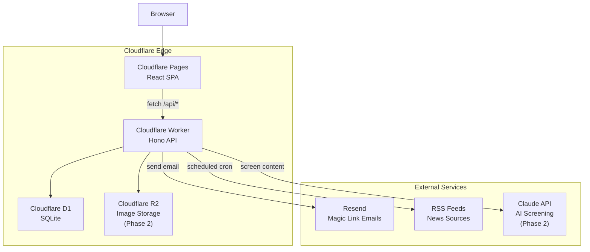
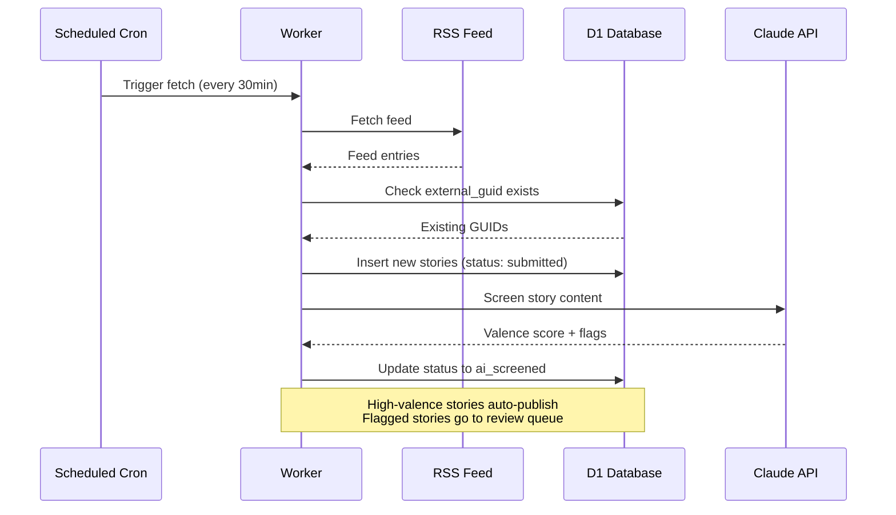
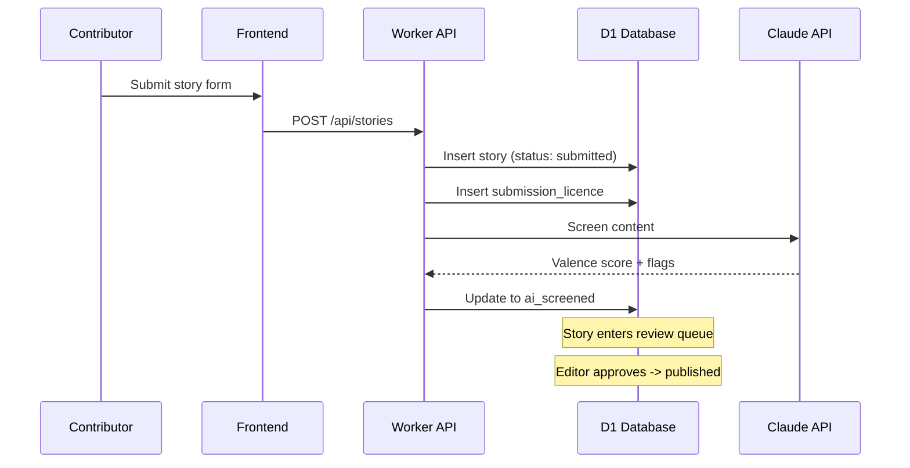
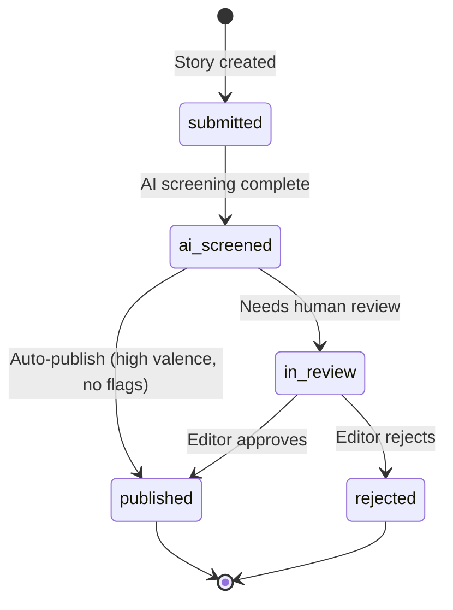
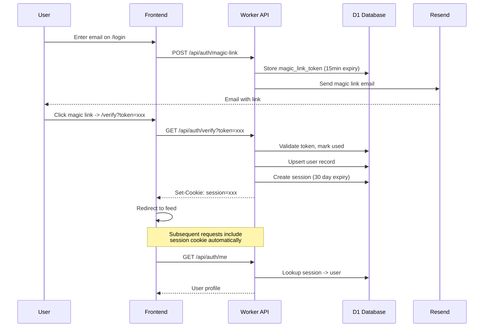
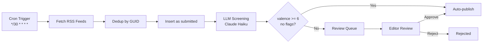

# Dochas Times Architecture

## System Architecture

## Data Flow: Aggregated Stories

## Data Flow: User Submissions

## Story State Machine

## Auth Flow (Magic Link)

## Phase 2: RSS Ingestion Pipeline

### Components

1. **RSS Service** (`worker/src/services/rss.ts`)
   - Parses RSS 2.0 and Atom feeds using `fast-xml-parser`
   - 10-second fetch timeout
   - Extracts: title, description, link, guid, pubDate
   - Strips HTML from content

2. **LLM Screening Service** (`worker/src/services/llm.ts`)
   - Calls Anthropic API (Claude Haiku `claude-haiku-4-5-20251001`)
   - Scores stories against editorial rubric (valence 0-10)
   - Categories: community, youth, environment, charity, milestone, event, other
   - Flags: none, unverifiable, possible_ad, safeguarding, needs_context
   - Defensive JSON parsing (strips code fences, fallback on parse failure)

3. **Cron Ingestion** (`worker/src/cron/ingest.ts`)
   - Runs every 30 minutes via Cloudflare cron trigger
   - Fetches all active sources, deduplicates by `external_guid`
   - Screens new stories via LLM in batches of 5
   - Auto-publishes stories with `valence_score >= 6`, `flags = ["none"]`, `needs_human_check = false`
   - Otherwise sets status to `ai_screened` for human review

4. **Admin Routes** (`worker/src/routes/admin.ts`)
   - CRUD for RSS sources (requires admin/editor role)
   - Manual fetch trigger per source
   - Review queue with AI screening data
   - Publish/reject actions

### Ingestion Flow

### Admin UI

- **Sources page** (`/admin/sources`): CRUD for RSS sources, manual fetch, active toggle
- **Review Queue** (`/admin/review`): stories pending review with AI screening details, publish/reject actions
