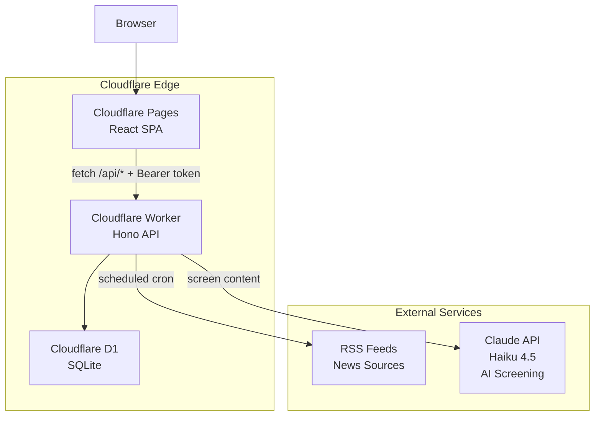
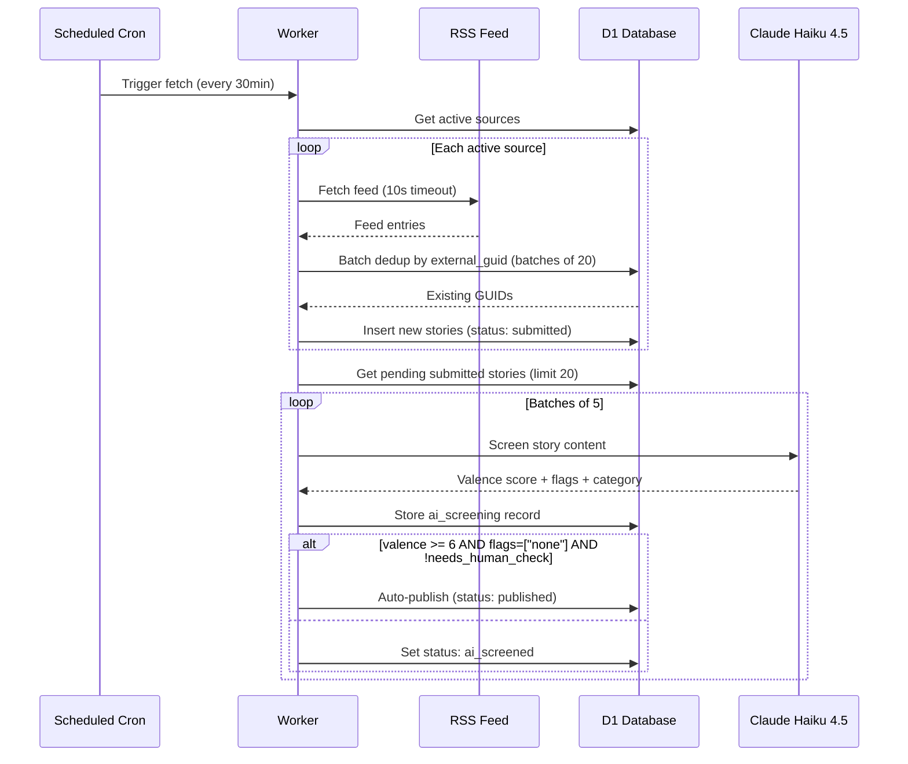
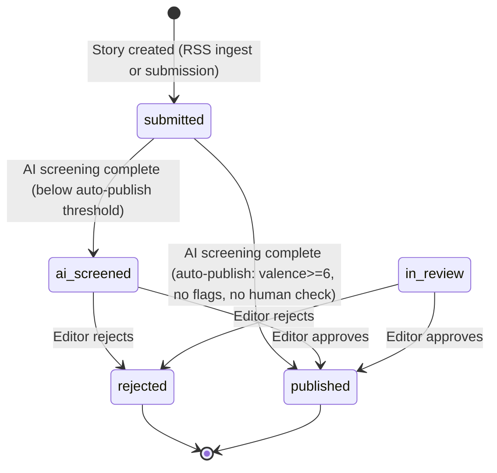
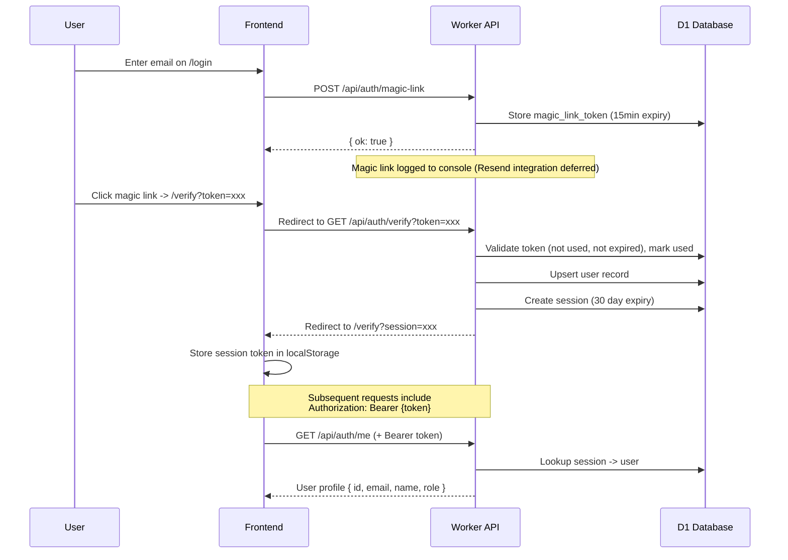
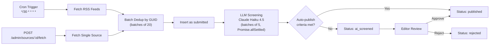

# Dochas Times Architecture

## System Architecture



## Data Flow: Aggregated Stories



## Story State Machine



## Auth Flow (Magic Link + Bearer Token)



## LLM Screening Pipeline

The screening pipeline uses Claude Haiku 4.5 (`claude-haiku-4-5-20251001`) to evaluate stories against an editorial rubric.

### Rubric Prompt

The LLM receives a structured prompt that asks it to score stories on a 0-10 valence scale:

- **ACCEPT (6-10)**: Genuine improvements, solutions, generosity, recovery, community, milestones
- **REJECT (0-3)**: Toxic positivity, ads, tragedy-spin, safeguarding issues, hate, unverifiable claims

### Response Schema

```json
{
  "is_positive": true,
  "category": "community|youth|environment|charity|milestone|event|other",
  "valence_score": 0-10,
  "locality": "place name or UK-wide",
  "why_one_line": "one sentence rationale",
  "suggested_headline": "reworded headline",
  "flags": ["none"] or ["unverifiable", "possible_ad", "safeguarding", "needs_context"],
  "needs_human_check": false
}
```

### Defensive Parsing

The `parseResponse` function handles common LLM output variations:
1. Strips markdown code fences (with or without `json` tag)
2. Extracts JSON from surrounding text
3. Clamps `valence_score` to 0-10
4. Normalises `flags` to array if returned as string
5. Falls back to `parse_error` flag on JSON failure

### Auto-Publish Criteria

A story is auto-published when ALL of the following are true:
- `valence_score >= 6`
- `is_positive === true`
- `flags === ["none"]` (exactly one element, and it's "none")
- `needs_human_check === false`

Otherwise, the story goes to `ai_screened` status for human review.

## Ingestion Pipeline



### Batch Processing Details

- Feed entries are deduped against existing `external_guid` values in batches of 20 (to stay within D1's SQL variable limit)
- LLM screening processes up to 20 pending stories per run, in batches of 5 concurrent requests using `Promise.allSettled`
- Failed screenings are logged but don't block other stories

## API Endpoints

### Public

| Method | Path | Description |
|--------|------|-------------|
| GET | `/api/stories` | List published stories. Query params: `category`, `cursor`, `limit` (1-100, default 20) |
| GET | `/api/stories/:id` | Get single published story |
| GET | `/api/categories` | List valid categories |
| GET | `/health` | Health check |

### Auth

| Method | Path | Description |
|--------|------|-------------|
| POST | `/api/auth/magic-link` | Request magic link. Body: `{ email }` |
| GET | `/api/auth/verify` | Verify magic link token. Query: `token`. Redirects to frontend with session |
| GET | `/api/auth/me` | Get current user (requires Bearer token) |
| POST | `/api/auth/logout` | Destroy session (Bearer token or cookie) |

### Admin (requires `admin` or `editor` role)

| Method | Path | Description |
|--------|------|-------------|
| GET | `/api/admin/sources` | List RSS sources |
| POST | `/api/admin/sources` | Create source. Body: `{ name, feed_url, type?, url?, terms_ok? }` |
| PUT | `/api/admin/sources/:id` | Update source fields |
| DELETE | `/api/admin/sources/:id` | Delete source |
| POST | `/api/admin/sources/:id/fetch` | Trigger manual fetch for source |
| GET | `/api/admin/review-queue` | List stories with `ai_screened` or `in_review` status |
| POST | `/api/admin/stories/:id/publish` | Publish a reviewed story |
| POST | `/api/admin/stories/:id/reject` | Reject a story. Body: `{ reason? }` |

## Environment Variables and Secrets

### Worker (wrangler.toml / Cloudflare dashboard)

| Variable | Type | Description |
|----------|------|-------------|
| `DB` | D1 Binding | Cloudflare D1 database (dochas-times) |
| `ANTHROPIC_API_KEY` | Secret | API key for Claude Haiku screening (set via `wrangler secret put`) |
| `FRONTEND_URL` | Variable | Frontend URL for auth redirects (default: `https://dochas-times.pages.dev`) |

### Frontend (build-time env)

| Variable | Description |
|----------|-------------|
| `VITE_API_URL` | Worker API base URL (default: `http://localhost:8787`) |

## Database Schema (D1)

Key tables:
- `user` — id, email, name, role, home_patch_id, created_at
- `session` — id, user_id, token, expires_at, created_at
- `magic_link_token` — email, token, used, expires_at
- `source` — id, name, type, url, feed_url, terms_ok, active, last_fetched_at, created_at
- `story` — id, origin, patch_id, source_id, contributor_id, title, body, snippet, external_url, external_guid, photo_url, photo_consent, status, category, valence_score, flags, rejection_reason, created_at, published_at, updated_at
- `ai_screening` — id, story_id, raw_json, model_version
- `engagement` — id, story_id, user_id, type

## Admin UI

- **Sources page** (`/admin/sources`): CRUD for RSS sources, manual fetch trigger, active/inactive toggle
- **Review Queue** (`/admin/review`): Stories pending review with AI screening details (valence bar, flags, rationale), publish/reject actions
